# What is a Skill?

Agent skills are modular packages of domain-specific knowledge that extend an AI agent's capabilities. Defined in SKILL.md files with frontmatter metadata and markdown instructions, they allow agents to handle specialized tasks—like Azure deployments or diagnostics—by loading relevant context on-demand when triggered by user queries. The generally provide guidance and step-by-step workflows to address particular scenarios.

# Comparison with Agents and Tools

```mermaid
flowchart LR
    A[🤖 Agent] -->|loads knowledge from| S[📚 Skills]
    S -->|guides use of| T[🔧 Tools]
    A -->|invokes| T
```



- **Agents** are the AI systems that reason about user requests and orchestrate solutions. They load skills for knowledge, invoke tools for actions, and maintain conversation context. An agent decides *what* to do based on the guidance in skills and carries out the *how* using tools.
- **Skills** provide knowledge and instructions—they tell the agent how to approach a problem, what best practices to follow, and when to use certain techniques. They're static markdown documents loaded as context.
- **MCP Tools** provide capabilities and actions—they let the agent actually do things like query Azure resources, read files, or execute commands. They're executable functions that return data.

They're complementary: a skill might instruct the agent to "use the mcp_azure_mcp_cosmos tool to list databases" as part of a larger workflow while providing guidance on how to interpret results and handle edge cases. Skills are the "brain" (knowledge), MCP tools are the "hands" (actions).

# General Development Guidance

A skill may encourage or even require the use of certain tools, but should not duplicate the functionality of a tool or simply list tool descriptions.

A skill should contain information that is applicable across agents and scenarios.

Skills should be fairly "chunky". For example, orchestrating a deployment to Azure uses three primary skills in this repo:


These contain all the instructions necessary to deploy across multiple resource types and varying runtimes. To avoid overwhelming the language model with irrelevant information, the root SKILL.md provides high-level information and then links to more specific documents in various subfolders (see below). The LM will pull these documents in as needed.

# General Skill Layout
```
skills-directory/your-skill-name/
├── SKILL.md              # Main skill definition (required)
├── LICENSE.txt           # License file (if applicable)
├── references/           # Additional reference documentation
│   └── *.md
├── examples/             # Example code and templates
│   └── *
└── scripts/              # Helper scripts
    └── *
```
