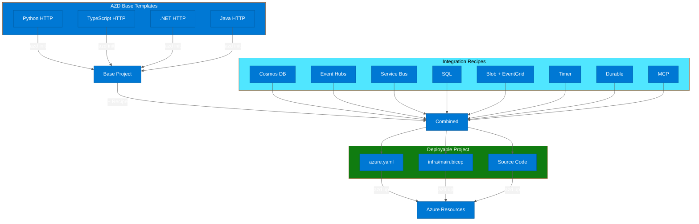
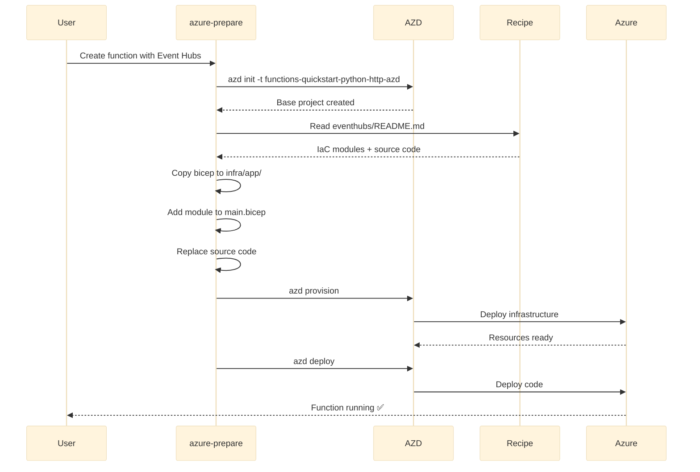
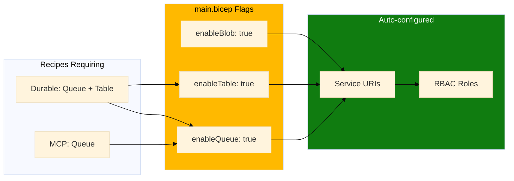

# Composable Recipes Architecture

Azure Functions recipe composition flow showing how base templates combine with integration recipes.

## Recipe Composition Flow

## Storage Endpoint Flags

For recipes requiring additional storage access:

