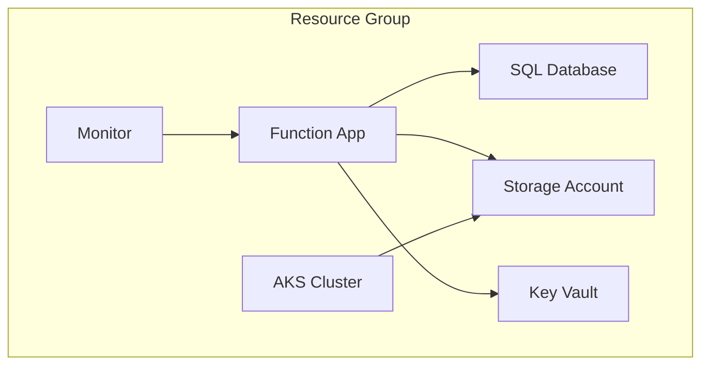
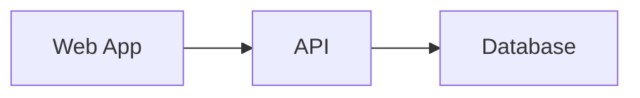

# Azure Resource Visualizer

Generate architecture diagrams from Azure resource groups, sketches, or descriptions.

## Prerequisites

- Azure CLI + active session (required)
- Draw.io MCP server (recommended)
- Draw.io VS Code extension (optional)

## When to Use This Skill

- Create architecture diagrams from Azure resource groups
- Visualize resource connections and relationships
- Generate Mermaid or Draw.io diagrams from live Azure
- Convert sketches or descriptions to architecture diagrams
- Analyze resource group topology and infrastructure mapping

## Routing

| Trigger | Workflow |
|---|---|
| "sketch" / "whiteboard" / "description" | [sketch-to-diagram-workflow.md](references/sketch-to-diagram-workflow.md) |
| "draw.io" / "drawio" / "rich diagram" | [azure-to-diagram-workflow.md](references/azure-to-diagram-workflow.md) |
| "mermaid" / default | [mermaid-diagram-workflow.md](references/mermaid-diagram-workflow.md) |

See also: [drawio-diagram-conventions.md](references/drawio-diagram-conventions.md)

## Mermaid Diagram Workflow

### Resource Group Selection

Confirm target resource group and subscription before proceeding.

### Resource Discovery & Analysis

Use [Azure Resource Graph](references/azure-resource-graph.md) to discover all resources and their properties.

### Diagram Construction

Build the diagram using Mermaid syntax:

For horizontal layouts:

## Key Diagram Requirements

- **Subgraphs**: Group resources by Resource Group or logical layer
- Map relationships between all resources:
  - Network connections (VNet, subnet, NSG, private endpoints)
  - Data flow (app → database, app → storage, messaging)
  - Identity, RBAC, and authentication bindings
  - Security rules and access policies

## Quality Standards

| Criterion | Requirement |
|---|---|
| Accuracy | Diagram matches live Azure state |
| Completeness | All resources and connections shown |
| Readability | Clear labels, logical grouping |

- Read-only analysis — never modify Azure resources
- ❌ Never proceed without confirming resource group selection

## Error Handling

| Error | Cause | Remediation |
|---|---|---|
| No resources found | Empty/wrong resource group | Verify name and subscription |
| Permission denied | Missing RBAC | Check Reader role |
| Draw.io MCP tool not found | MCP not configured | Outputs `.drawio` XML; open with VS Code Draw.io extension |
| 50+ resources | Large resource group | Split by layer or use Draw.io |
