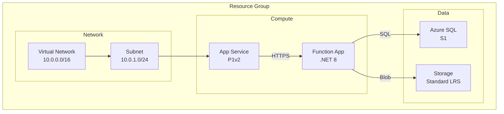

# Mermaid Diagram Guide

## Example

## Requirements

| Requirement | Example |
|-------------|---------|
| Group by layer | Network, Compute, Data, Security |
| Include details | SKUs, tiers in labels with ` ` |
| Label connections | Describe data flow |
| Visual hierarchy | Subgraphs for grouping |

## Connection Types

- `-->` data flow/dependencies
- `-.->` optional connections
- `==>` critical paths

## Syntax

- `graph TB` (top-bottom) or `graph LR` (left-right)
- Subgraph: `subgraph "Name"`
- Node: `ID["Name Details"]`
- Connection: `SOURCE -->|"Label"| TARGET`
